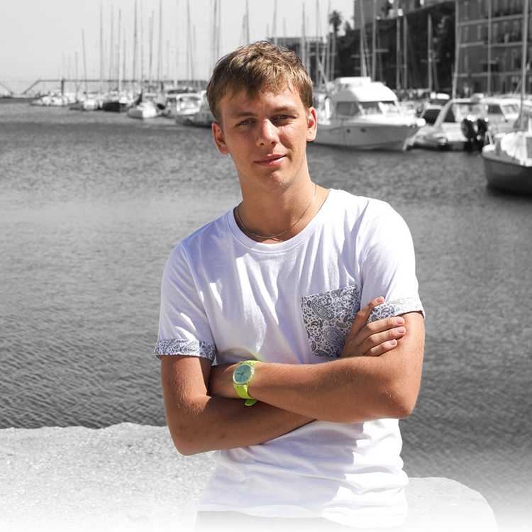

# Anton Starovoitov

Junior Front-End Developer

### ☎️ Contacts:

- E-mail: [artantstar@gmail.com](mailto:artantstar@gmail.com)
- Telegram: [@artantstar](https://t.me/artantstar)
- Discord: @Art#5338
- GitHub: [artantstar](https://github.com/artantstar)

### 🤵 About me:

Was born in St. Petersburg, Russia. Graduated from St. Petersburg State Marine Technical University with a degree in Informatics and Computer Engineering. Since childhood I have been fond of computer technologies and I want to work in this area.

### 🔧 My skills:

- HTML
- CSS
- JavaScript
- Git

### 📄 Code example:

_Javascript:_

```
function solution(str) {
  return str.split("").reverse().join("");
}
```

### 📚 Graduation:

- St. Petersburg State Marine Technical University, Russia: 2016 - 2020

### 🌎 English level:

- A2 (Pre-Intermediate)
